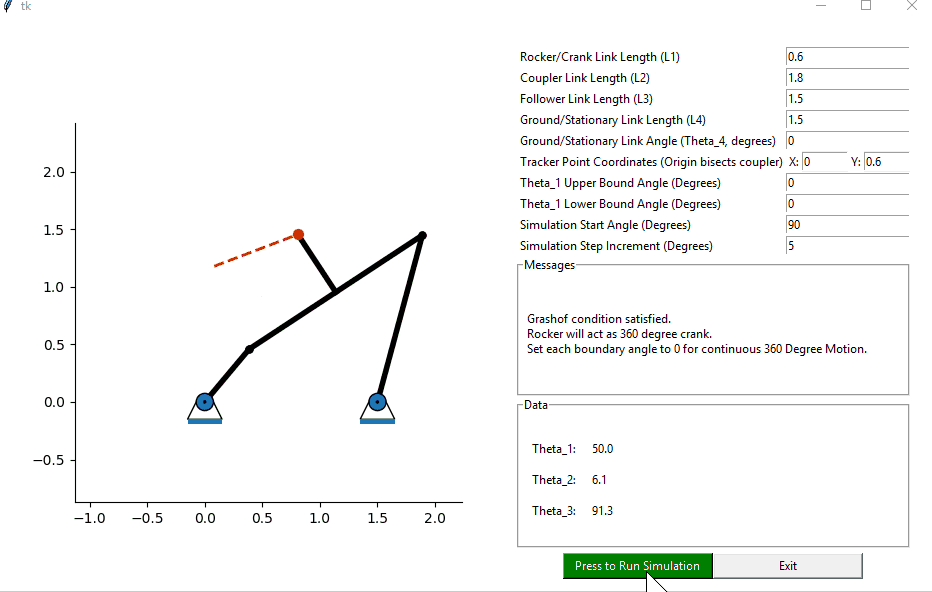
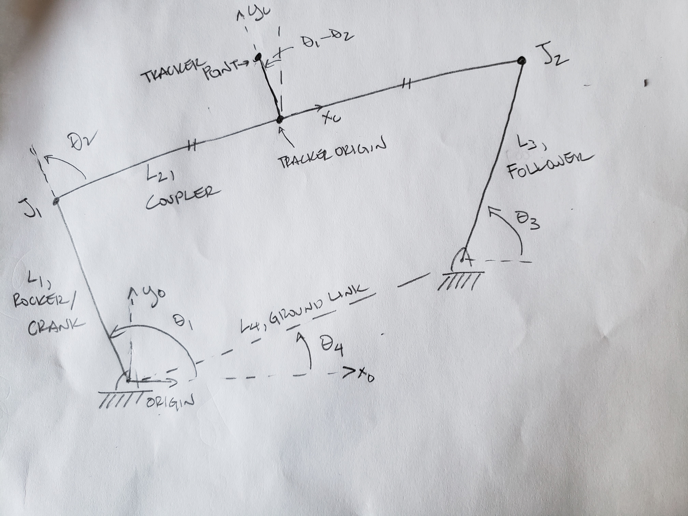
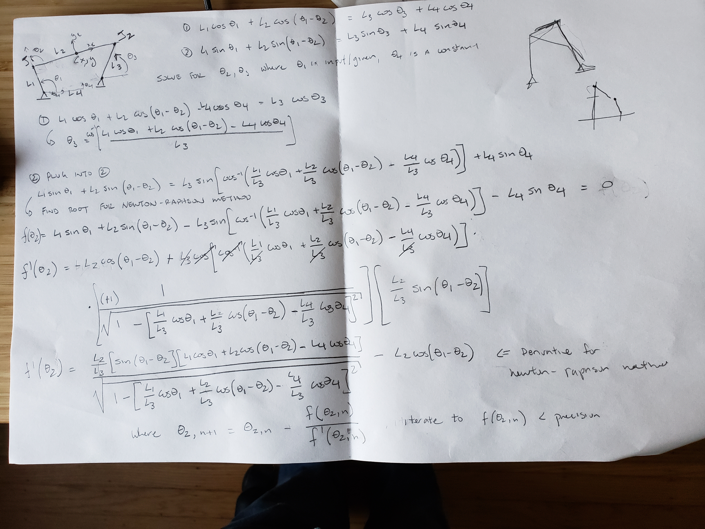

This script exists to quickly analyze the geometry and motion of 4 bar linkages.  A gif demo of the program working is below:

I needed a good simulator to analyze linkage motion for robotics projects. I wrote this script to meet my needs, and I thought I would clean up the GUI and share it here.  I would love any feedback you have and please feel free to branch and improve the code.

The trinometry and numberical methods can be a bit unwieldy at first glance, so here's a bit of explanation.  A 4-bar linkage can generically be described by the diagram below:

More details on 4-bar linkage geometry can be found at .

With the geometry shown, a 2-DOF system of equations can developed, assuming the crank/rocker angle is controlled via an acuator (e.g., stepper motor, worm gear, drive lever).  The system of equations are solved as below:

An explicit solution for this system of equations cannot be found through algebra/trig identities, but multiple numerical solution methodologies are avialable.  This script implements the Newton-Raphson method to solve for theta_2, allowing an analytical solution to theta_3.  If the Newton-Rapshon method fails, a Runge-Kutta approximation is attempted.  When both fail, the simulation fails, and a smaller input angle increment is suggested for the next attempt so the Newton-Rapshon method can resolve.

Note that this scirpt automatically checks the link lengths for the Grashof condition, and does not resolve initial geometry while the simulation is not running.  If you want simulate non-Grashof linkages, start from a Grashof initial condition in the simulator that closely resembles the non-Grashof geometry.  The rocker angle can be bounded to simulate motion of non-Grashof linkages.

I have taken the script as far as I need to for my current design purpose, but I have a couple of other ideas to improve the simulation for future use.  These next steps / TODOs include:
* Calculate point forces and velocities from an input torque and velocity
* Automate 3 point method to solve for linkage geometry based on pathway
* Auto-reset when user accidentally inputs unsolvable condition causing crash

